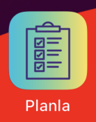
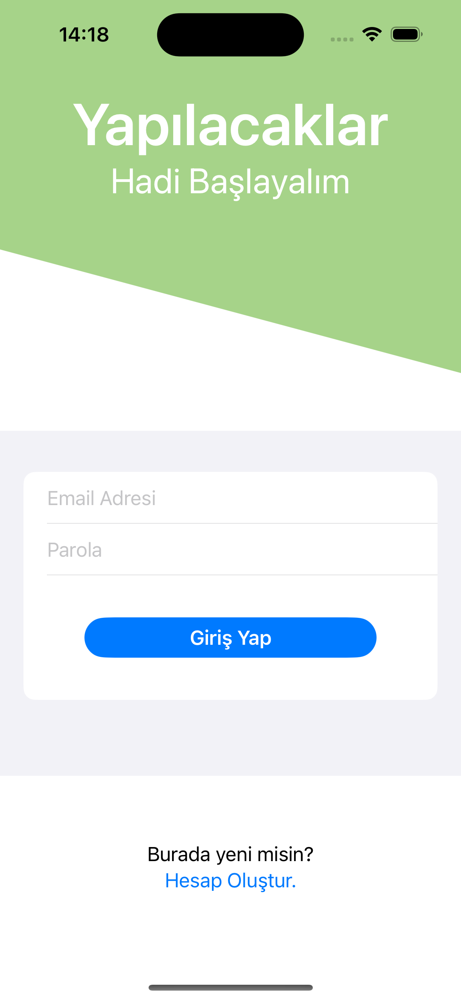
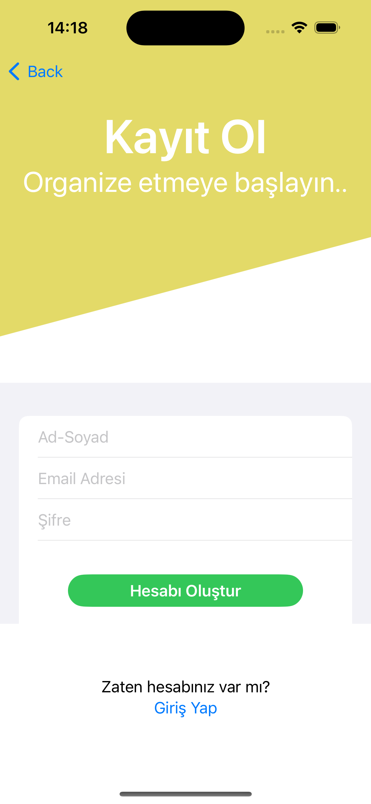
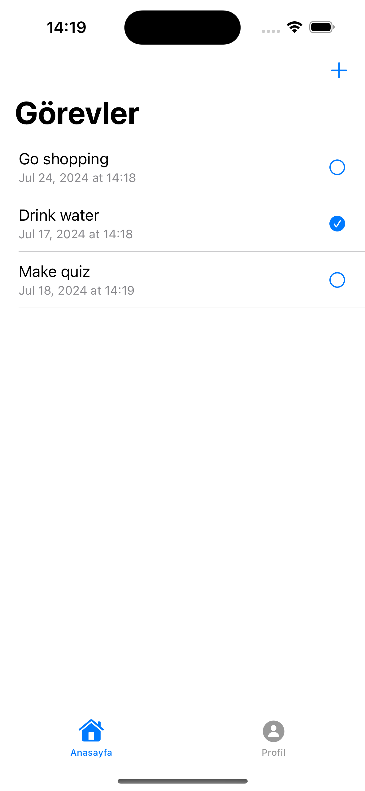
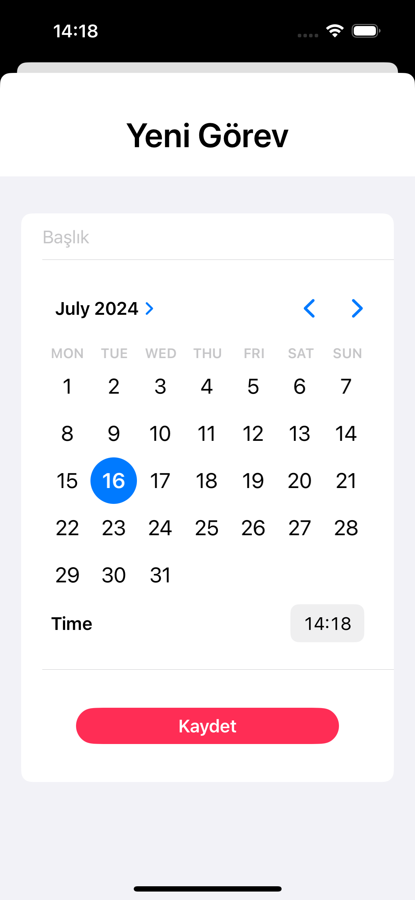
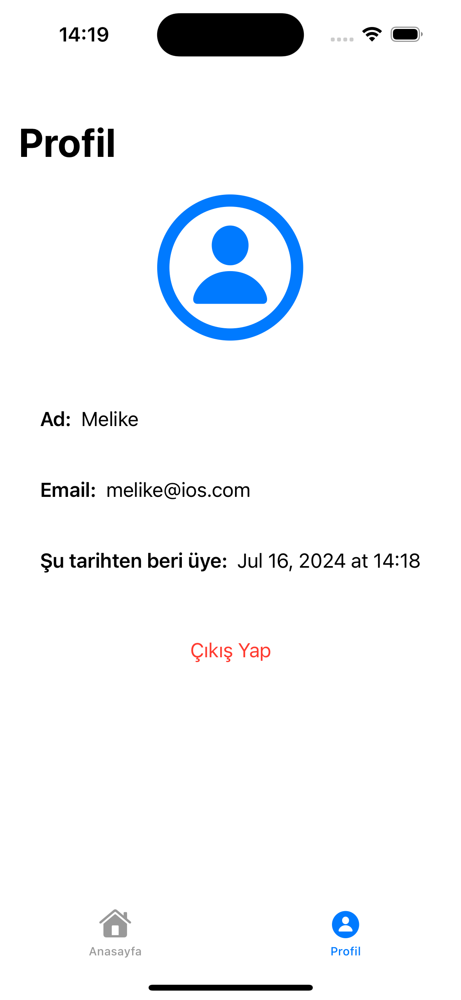

# 📝 ToDoFirebase

ToDoFirebase is an iOS application that allows you to create and manage a to-do list using Firebase. This application enables users to add, delete, and update tasks. It also supports user authentication and registration.

## 🚀 Features

- 👤 User authentication and registration
- ✅ Create, update, and delete to-do list items
- 📅 Update task completion status
- 📄 View and edit user profile

## 📋 Requirements

- iOS 14.0 or later
- Xcode 12.0 or later
- Firebase account and project setup

## 🛠️ Technologies Used

- **Swift**
- **SwiftUI**
- **Firebase**
  - Firebase Authentication
  - Firebase Firestore
- **Swift Package Manager (SPM)**
- **Xcode**

## 🛠️ Setup

1. **Firebase Configuration:**

   - Create a new project in the Firebase Console.
   - Add your iOS app to your Firebase project.
   - Download the `GoogleService-Info.plist` file and add it to your Xcode project.

2. **Xcode Project:**

   - Clone or download this repository.
   - Open the project in Xcode.
   - Ensure the `GoogleService-Info.plist` file is correctly added.
   - **Add Firebase SDKs using Swift Package Manager:**
     - Open the project in Xcode.
     - Go to File > Swift Packages > Add Package Dependency.
     - Enter the Firebase GitHub repository URL: `https://github.com/firebase/firebase-ios-sdk`
     - Select the Firebase modules you want to include (e.g., FirebaseAuth, FirebaseFirestore).

## 📱 Usage

1. Run the app in Xcode.
2. Log in or create a new account.
3. Add new tasks to the to-do list, mark them as completed, or delete them.
4. View and edit your user information on the profile page.

## 📂 Project Structure

- `ToDoFirebaseApp.swift`: Main entry point and Firebase configuration.
- `Extensions.swift`: General extensions and helper functions.
- `User.swift`: User model structure.
- `ToDoListItem.swift`: To-do list item model structure.
- `MainView.swift`: Main view and session control.
- `ToDoListView.swift`: To-do list view.
- `ProfileView.swift`: User profile view.
- `NewItemView.swift`: View for adding new to-do list items.
- `LoginView.swift`: User login view.
- `RegisterView.swift`: User registration view.
- `HeaderView.swift`: Header view component.
- `TLButton.swift`: Custom button component.

## 🖼️ Screenshots

## 🤝 Contribution

If you would like to contribute, please create a pull request or open an issue. All contributions are welcome!

